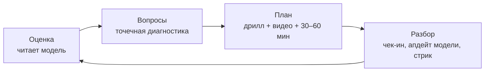

# AI Tennis Coach — v1 Build Spec
*Хэндофф для Claude Code. Версия плана: v1 — личный коуч, без видеоанализа и без аватара.*

## Цель
Персональный AI теннис-коуч в Telegram, который держит модель моей игры и ведёт **ежедневный цикл подотчётности** (30–60 мин/день), чтобы техника «влезала в ДНК». Двуязычный: RU + EN.

## В скоупе v1
- **Telegram-бот** — основной интерфейс, ежедневная петля.
- **Планировщик** — ежедневные пуши по расписанию.
- **«Мозг» (Claude API)** — генерит фокус дня, дрилл, подбирает видео, разбирает чек-ин, обновляет модель игрока.
- **Модель игрока** — персистентное хранилище (см. ниже).
- **Голос (TTS)** — ежедневное голосовое от коуча (Qwen3-TTS, RU + EN).
- **Двуязычие RU + EN.**

## Отметки на будущее (v2+)
- **Аватар — отложен.** В чисто текст+войс версии у лица нет оформленной роли (дорогой был именно живой звонок, а не лицо). Когда добавляем — стартуем со **стилизованного** аватара (видео-кружок в Telegram или «экран коуча» в Mini App), а не фотореала. **Заложить аватар сменным модулем** (interface/adapter), чтобы позже без боли заменить на фотореалистичный realtime (Tavus / HeyGen). Голос и «мозг» при этом не меняются.
- **Реальные звонки** — позже: outbound-созвон голосовым агентом (Retell / Vapi / Bland / ElevenLabs). Отдельный модуль поверх «мозга».

## Вне скоупа v1 (отложено)
- Аватар (любой — стилизованный и фотореал).
- Реальные телефонные звонки.
- Видеоанализ техники (MediaPipe и т.п.) — отдельный трек.

## Стек (рекомендации)
- **Бот:** Python + `aiogram` (или `python-telegram-bot`).
- **Планировщик:** GitHub Actions cron (бесплатно) или мелкий VPS / Fly.io.
- **LLM:** Claude API — `Sonnet 4.6` дефолт для коучинга, `Haiku 4.5` для дешёвых шагов; prompt caching на модель игрока. (API биллится отдельно от Max-подписки.)
- **TTS:** **Qwen3-TTS** (Alibaba, open-weights) — 10 языков вкл. RU + EN, кросс-язычное клонирование голоса с 3 сек, контроль эмоций/просодии. Self-host: веса на HuggingFace / ModelScope, запуск на GPU или serverless (RunPod / Modal / Lambda) — для редких ежедневных войсов компьют копеечный. *Fallback, если не хочется возиться с self-host: ElevenLabs Multilingual / Cartesia (hosted, платно).* НЕ Miso One — он English-only.
- **(Опц.) STT** для голосовых ответов юзера: Whisper (локально/дёшево).
- **Видео-подбор:** своя курируемая библиотека YouTube-каналов под навыки + опц. YouTube Data API.

## Модель игрока (persistent)
Поля: уровень, стаж, сильные/слабые стороны, цели, физика (рост, одно/двуручный бэкхенд, рабочая рука), текущий фокус, история сессий + стрик, предпочтения (язык, время пуша).

## Цикл коуча

Эскалация: если юзер пропал — мягкая напоминалка, затем более настойчивая.

**Дневной поток (пример):** утро — пуш с фокусом + дриллом + видео (+ голосовое); вечер — чек-ин, разбор, апдейт стрика.

## Решения для подтверждения (дефолты — поправь под себя)
1. **Расписание:** дефолт = 1 утренний пуш (план дня) + 1 вечерний чек-ин, ежедневно. *// подтвердить*
2. **Язык по умолчанию:** дефолт = RU, переключатель `/en` (или авто по языку сообщения). *// подтвердить*
3. **Стартовый фокус навыков:** дефолт = разножка (split-step) + шадоу-свинги + работа ног; технический фокус — бэкхенд и подача. *// подтвердить*

## Бюджет
- **v1 ≈ $5–15/мес** — Claude API + дешёвый serverless-GPU под Qwen3-TTS + хостинг (~$0–5). Сама TTS-модель бесплатная, платишь только за компьют.
- Позже: реальные звонки +$15–45/мес; аватар — стилизованные видео-кружки несколько $/мес, фотореал +$15–120/мес.

## Порядок сборки (milestones)
- **M1** — бот + планировщик + «мозг» (Claude) + модель игрока → рабочий текстовый цикл.
- **M2** — голосовые: поднять Qwen3-TTS (serverless-GPU), генерить ежедневный войс на RU/EN.
- **M3** — курируемая видео-библиотека + подбор под фокус.
- **M4** — полировка: стрик, напоминалки, RU/EN-переключение.
